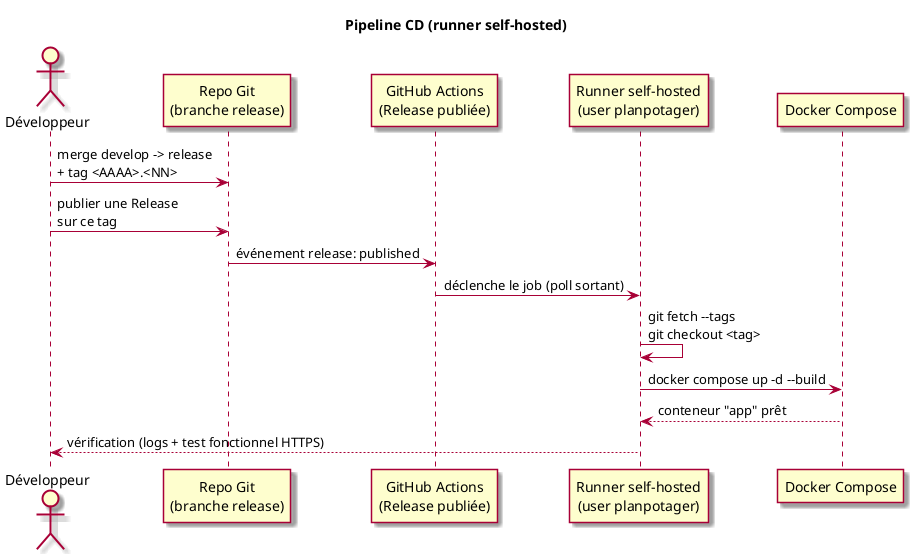

# Déploiement

> Complète le diagramme de déploiement de [`03_Conception_V1.0.md`](03_Conception_V1.0.md#déploiement) : ce document couvre la mise en œuvre concrète — préparation du serveur, déploiement initial, mises à jour et maintenance — pour la phase alpha-test.

## Table des matières

- [Déploiement](#déploiement)
  - [Table des matières](#table-des-matières)
  - [0. Contexte et contraintes](#0-contexte-et-contraintes)
  - [1. Architecture cible](#1-architecture-cible)
  - [2. Préparation de l'environnement serveur](#2-préparation-de-lenvironnement-serveur)
    - [2.1 Inventaire de l'existant](#21-inventaire-de-lexistant)
    - [2.2 Utilisateur système dédié](#22-utilisateur-système-dédié)
    - [2.3 Mise à jour du système](#23-mise-à-jour-du-système)
    - [2.4 Installation de Docker](#24-installation-de-docker)
    - [2.5 Pare-feu](#25-pare-feu)
    - [2.6 Nom de domaine](#26-nom-de-domaine)
    - [2.7 Reverse proxy et HTTPS](#27-reverse-proxy-et-https)
  - [3. Déploiement initial](#3-déploiement-initial)
    - [3.1 Prérequis côté code](#31-prérequis-côté-code)
    - [3.2 Arborescence sur le serveur](#32-arborescence-sur-le-serveur)
    - [3.3 Dockerfile](#33-dockerfile)
    - [3.4 docker-compose.prod.yml](#34-docker-composeprodyml)
    - [3.5 Secrets (.env)](#35-secrets-env)
    - [3.6 OAuth2 Google — client dédié à l'alpha](#36-oauth2-google--client-dédié-à-lalpha)
    - [3.7 Vhost Nginx](#37-vhost-nginx)
    - [3.8 Premier lancement](#38-premier-lancement)
  - [4. Mise à jour de l'application](#4-mise-à-jour-de-lapplication)
    - [4.1 Processus](#41-processus)
    - [4.2 Migrations de schéma](#42-migrations-de-schéma)
    - [4.3 Rollback](#43-rollback)
  - [5. Maintenance](#5-maintenance)
    - [5.1 Sauvegardes](#51-sauvegardes)
    - [5.2 Logs](#52-logs)
    - [5.3 Supervision légère](#53-supervision-légère)
    - [5.4 Renouvellement TLS](#54-renouvellement-tls)
    - [5.5 Mises à jour de sécurité du système](#55-mises-à-jour-de-sécurité-du-système)
    - [5.6 Checklist périodique](#56-checklist-périodique)
  - [6. Sécurité — récapitulatif](#6-sécurité--récapitulatif)
  - [7. CI/CD](#7-cicd)
    - [7.1 Intégration continue (CI)](#71-intégration-continue-ci)
    - [7.2 Déploiement continu (CD)](#72-déploiement-continu-cd)
    - [7.3 Sécurité du runner self-hosted](#73-sécurité-du-runner-self-hosted)
  - [Annexe : commandes utiles](#annexe--commandes-utiles)

---

## 0. Contexte et contraintes

Le serveur ciblé pour l'alpha-test est un serveur déjà loué et déjà utilisé pour héberger une blockchain de test. Deux contraintes en découlent, présentes tout au long de ce document :

- **Isolation** : PlanPotager ne doit jamais partager de réseau Docker, de port exposé ou de compte système avec les conteneurs de la blockchain, et inversement.
- **Partage de ressources** : CPU, RAM, disque et bande passante sont partagés avec la blockchain. Les étapes de préparation commencent donc par un inventaire de l'existant plutôt que par une remise à plat du serveur.

Conformément à [[project_single_server_deployment]] : frontend (Vue, buildé en statique), backend (Spring Boot) et MySQL restent sur ce même serveur, pas d'hébergement séparé.

## 1. Architecture cible

~~~plantuml
@startuml
title Architecture cible sur le serveur mutualisé
skin rose

actor "Alpha-testeur" as tester
actor "Toi (admin)" as admin

cloud "Google\n(Identity Provider OIDC)" as google

node "Serveur (VPS mutualisé)" {

  component "Nginx\n(reverse proxy, HTTPS 80/443)" as nginx

  node "Stack Docker : blockchain (existante)" as chainStack {
    component "Nœud(s) blockchain" as chain
  }

  node "Stack Docker : PlanPotager (nouvelle)" as ppStack {
    component "Spring Boot (Tomcat embarqué)\n+ Vue.js SPA (buildé en statique)" as app
    database "MySQL\n(PlanPotager, non exposée)" as db
  }

}

tester --> nginx : HTTPS\nalpha.<domaine>
nginx --> app : proxy_pass\n127.0.0.1:8080
app --> db : réseau Docker interne\n(aucun port publié)
app <--> google : OAuth2 / OIDC
admin --> nginx : HTTPS (déploiement, logs)

note right of chainStack
  Réseau Docker, volumes et
  utilisateur système séparés
  de la stack PlanPotager
end note

@enduml
~~~

Points clés de ce schéma :

- Un seul point d'entrée public : Nginx, sur 80/443. Ni le port Tomcat (8080), ni celui de MySQL (3306) ne sont exposés à l'extérieur.
- Chaque stack (`docker compose` blockchain / `docker compose` PlanPotager) a son propre réseau bridge — c'est le comportement par défaut de Docker Compose (un réseau par projet) tant qu'on n'utilise pas `network_mode: host` ni un réseau externe partagé entre les deux.

## 2. Préparation de l'environnement serveur

### 2.1 Inventaire de l'existant

Avant de toucher à quoi que ce soit, vérifier ce qui tourne déjà pour ne pas rentrer en conflit (ports, ressources) :

```bash
docker ps
ss -tulpn
df -h
free -h
```

### 2.2 Utilisateur système dédié

```bash
sudo adduser planpotager
sudo usermod -aG docker planpotager
```

Tous les fichiers, secrets et conteneurs de PlanPotager vivent sous ce compte, séparé du compte utilisé pour la blockchain.

### 2.3 Mise à jour du système

```bash
sudo apt update && sudo apt upgrade -y
```

Ne pas refaire un hardening déjà en place pour la blockchain (SSH, fail2ban, etc.) — vérifier juste qu'il existe.

### 2.4 Installation de Docker

Si Docker n'est pas déjà installé pour la blockchain (sinon, passer cette étape — un seul démon Docker suffit pour héberger plusieurs stacks isolées) :

```bash
curl -fsSL https://get.docker.com | sudo sh
sudo apt install docker-compose-plugin -y
docker --version && docker compose version
```

### 2.5 Pare-feu

```bash
sudo ufw allow OpenSSH
sudo ufw allow 80/tcp
sudo ufw allow 443/tcp
sudo ufw enable
sudo ufw status
```

Ne pas modifier les règles déjà ouvertes pour la blockchain, seulement ajouter les siennes. **Aucune règle n'ouvre 8080 ou 3306** : tout passe par Nginx.

### 2.6 Nom de domaine

Créer un enregistrement DNS `A` dédié, par exemple `alpha.<domaine>` → IP du serveur. Un sous-domaine séparé évite d'interférer avec ce qui existe déjà sur le domaine principal et donne une URL stable pour l'étape [3.6](#36-oauth2-google--client-dédié-à-lalpha) (redirect URI OAuth2).

### 2.7 Reverse proxy et HTTPS

```bash
sudo apt install nginx certbot python3-certbot-nginx -y
```

La configuration du vhost et l'activation HTTPS sont détaillées en [3.7](#37-vhost-nginx), une fois l'application déployée (Certbot a besoin du vhost en place pour délivrer le certificat).

HTTPS n'est pas optionnel ici : `httpClient.js` envoie les requêtes avec `credentials: 'include'` (cookie de session Spring Security) et le flux OAuth2/OIDC redirige vers Google puis revient sur le domaine — les deux ont besoin d'une origine stable et sécurisée.

## 3. Déploiement initial

### 3.1 Prérequis côté code

Deux points à corriger dans le code avant le premier déploiement (aucun des deux n'est bloquant pour le dev local, mais les deux le sont pour la prod) :

1. **`app.oauth2-success-url`** ([application.properties:33](../src/main/resources/application.properties)) est actuellement codé en dur sur `http://localhost:5173/profile`. Le templater en variable d'environnement, comme le reste du fichier (`${SERVER_PORT:8080}`) :
   ```properties
   app.oauth2-success-url=${APP_OAUTH2_SUCCESS_URL:http://localhost:5173/profile}
   ```
2. **Profil actif en production** : ne pas laisser `spring.profiles.active=local,dev` actif (le profil `dev` active les logs SQL, `local` attend un fichier de secrets qui n'existe pas sur le serveur). La variable d'environnement `SPRING_PROFILES_ACTIVE` prime sur la valeur du fichier — il suffit de la définir vide ou absente de tout profil `local`/`dev` dans `docker-compose.prod.yml` (voir [3.4](#34-docker-composeprodyml)), comme déjà indiqué en commentaire dans le fichier.

### 3.2 Arborescence sur le serveur

```
/home/planpotager/
  app/
    docker-compose.prod.yml
    Dockerfile
    .env                    # secrets, jamais commité
    sql/
      structure.sql
      data.sql
  backups/
```

Le plus simple est de cloner le dépôt directement dans `app/` (`git clone` puis `git checkout <tag>`), de façon à réutiliser `sql/structure.sql` et `sql/data.sql` tels quels plutôt que de les dupliquer.

### 3.3 Dockerfile

Build multi-stage : le SPA Vue est buildé puis copié dans les ressources statiques de Spring Boot, conformément à l'architecture "un seul exécutable" ([[project_single_server_deployment]]).

```dockerfile
# --- Étape 1 : build du frontend (Vue / Vite) ---
FROM node:22-alpine AS frontend-build
WORKDIR /frontend
COPY frontend/package*.json ./
RUN npm ci
COPY frontend/ .
RUN npm run build

# --- Étape 2 : build du backend (Spring Boot / Gradle) ---
FROM eclipse-temurin:25-jdk AS backend-build
WORKDIR /app
COPY . .
COPY --from=frontend-build /frontend/dist src/main/resources/static
RUN chmod +x gradlew && ./gradlew bootJar -x test

# --- Étape 3 : image d'exécution ---
FROM eclipse-temurin:25-jre
WORKDIR /app
COPY --from=backend-build /app/build/libs/*.jar app.jar
EXPOSE 8080
ENTRYPOINT ["java", "-jar", "app.jar"]
```

> Le toolchain Gradle du projet est épinglé sur Java 25 ([build.gradle:12](../build.gradle)) sans plugin de résolution de toolchain (`foojay-resolver`) : builder avec une image de base qui fournit déjà exactement ce JDK (comme ci-dessus) évite que Gradle essaie de le télécharger pendant le build. Si `eclipse-temurin:25-*` n'est pas encore disponible au moment du déploiement, ajouter le plugin `org.gradle.toolchains.foojay-resolver-convention` plutôt que de changer la version du toolchain.

### 3.4 docker-compose.prod.yml

```yaml
services:
  app:
    build: .
    restart: unless-stopped
    ports:
      - "127.0.0.1:8080:8080"   # jamais publié en dehors du localhost du serveur
    environment:
      - SPRING_PROFILES_ACTIVE=              # ni local, ni dev (voir 3.1)
      - DB_URL=jdbc:mysql://mysql:3306/mydatabase?useSSL=false&allowPublicKeyRetrieval=true&serverTimezone=UTC
      - DB_USERNAME=${DB_USERNAME}
      - DB_PASSWORD=${DB_PASSWORD}
      - GOOGLE_CLIENT_ID=${GOOGLE_CLIENT_ID}
      - GOOGLE_CLIENT_SECRET=${GOOGLE_CLIENT_SECRET}
      - APP_OAUTH2_SUCCESS_URL=https://alpha.<domaine>/profile
    depends_on:
      - mysql
    logging:
      driver: json-file
      options:
        max-size: "10m"
        max-file: "3"

  mysql:
    image: mysql:8.4
    restart: unless-stopped
    environment:
      - MYSQL_DATABASE=mydatabase
      - MYSQL_USER=${DB_USERNAME}
      - MYSQL_PASSWORD=${DB_PASSWORD}
      - MYSQL_ROOT_PASSWORD=${DB_ROOT_PASSWORD}
    volumes:
      - mysql_data:/var/lib/mysql
      - ./sql/structure.sql:/docker-entrypoint-initdb.d/01-structure.sql
      - ./sql/data.sql:/docker-entrypoint-initdb.d/02-data.sql
    # Pas de "ports:" ici : MySQL n'est joignable que depuis le conteneur "app",
    # via le réseau interne créé par ce compose file.

volumes:
  mysql_data:
```

Différence volontaire avec [`compose.yaml`](../compose.yaml) (dev local) : celui-ci publie `13306:3306` pour un accès direct depuis la machine du développeur ; en production ce port n'est jamais publié (accès DBeaver : voir [annexe](#annexe--commandes-utiles)). `logging.max-size` limite la taille des logs — utile sur un disque déjà partagé avec la blockchain.

Limiter aussi les ressources du service `app` (`deploy.resources.limits` en Compose v2, ou `mem_limit`/`cpus` en syntaxe courte) si la blockchain est sensible à la contention CPU/RAM ; à ajuster selon la marge constatée en [2.1](#21-inventaire-de-lexistant).

### 3.5 Secrets (.env)

Fichier `.env` à côté de `docker-compose.prod.yml`, **non commité** (même logique que `application-local.properties`, déjà dans `.gitignore`) :

```
DB_USERNAME=planpotager
DB_PASSWORD=<mot de passe fort généré>
DB_ROOT_PASSWORD=<mot de passe fort généré>
GOOGLE_CLIENT_ID=<client id du client OAuth2 "alpha">
GOOGLE_CLIENT_SECRET=<client secret correspondant>
```

### 3.6 OAuth2 Google — client dédié à l'alpha

Créer un **nouveau** client OAuth2 dans Google Cloud Console (APIs & Services > Credentials), distinct de celui utilisé en dev local — ne pas réutiliser le client de développement en production :

- Type : Application Web
- Redirect URI : `https://alpha.<domaine>/login/oauth2/code/google`

### 3.7 Vhost Nginx

```nginx
server {
    listen 80;
    server_name alpha.<domaine>;

    location / {
        proxy_pass http://127.0.0.1:8080;
        proxy_set_header Host $host;
        proxy_set_header X-Real-IP $remote_addr;
        proxy_set_header X-Forwarded-For $proxy_add_x_forwarded_for;
        proxy_set_header X-Forwarded-Proto $scheme;
    }
}
```

```bash
sudo ln -s /etc/nginx/sites-available/planpotager /etc/nginx/sites-enabled/
sudo nginx -t && sudo systemctl reload nginx
sudo certbot --nginx -d alpha.<domaine>
```

Certbot réécrit le vhost pour rediriger 80→443 et ajoute le certificat.

### 3.8 Premier lancement

```bash
cd /home/planpotager/app
docker compose -f docker-compose.prod.yml up -d --build
docker compose -f docker-compose.prod.yml logs -f app
```

Vérifications : `https://alpha.<domaine>/` charge le SPA, `https://alpha.<domaine>/api/registry/...` répond, et le flux de connexion Google (bouton login → redirection Google → retour sur `/profile`) fonctionne de bout en bout.

## 4. Mise à jour de l'application

~~~plantuml
@startuml
title Pipeline de mise à jour
skin rose

actor Développeur as dev
participant "Repo Git\n(branche release)" as git
participant "Serveur" as server
participant "Docker Compose" as compose

dev -> git : merge develop -> release\n+ tag <AAAA>.<NN>
dev -> server : git fetch --tags\ngit checkout <tag>
server -> compose : docker compose up -d --build
compose -> compose : rebuild image\n(frontend + backend)
compose -> compose : recrée le conteneur "app"\n(conteneur "mysql" et son volume inchangés)
compose --> server : conteneur "app" prêt
dev -> server : vérification manuelle\n(logs + test fonctionnel HTTPS)

@enduml
~~~

### 4.1 Processus

Conformément à [`gitFlow.md`](gitFlow.md) : on déploie depuis un tag de la branche `release` (`<AAAA>.<NN>`), pas directement depuis `develop`.

```bash
cd /home/planpotager/app
git fetch --tags
git checkout 2026.03
docker compose -f docker-compose.prod.yml up -d --build
```

> Une fois la CD en place ([7.2](#72-déploiement-continu-cd)), ces mêmes commandes sont exécutées automatiquement par le runner self-hosted à la publication d'une Release GitHub sur le tag correspondant. Elles restent la procédure de repli si le runner est hors service ou pour un déploiement hors procédure normale.

Seul le conteneur `app` est recréé ; `mysql` et son volume ne sont pas touchés. Coupure de service limitée au temps de redémarrage du conteneur `app` (quelques secondes) — acceptable pour un alpha-test.

### 4.2 Migrations de schéma

Le projet n'a pas d'outil de migration (Flyway/Liquibase) : `spring.jpa.hibernate.ddl-auto=validate` ([application.properties:16](../src/main/resources/application.properties)) refuse de démarrer si le schéma ne correspond pas exactement aux entités. Le schéma est donc **toujours modifié à la main, avant** de déployer une version de code qui en dépend :

1. Écrire les instructions `ALTER`/`CREATE` nécessaires dans un fichier daté sous `sql/migrations/` (dossier à créer, purement documentaire tant qu'il n'y a pas d'outil pour les rejouer automatiquement).
2. Les appliquer sur la base en cours d'exécution :
   ```bash
   docker exec -i <conteneur_mysql> mysql -u root -p"$MYSQL_ROOT_PASSWORD" mydatabase < sql/migrations/2026-03-xx_description.sql
   ```
3. Reporter le même changement dans `sql/structure.sql` (source de vérité pour une base recréée de zéro).
4. Déployer la nouvelle version du code (étape [4.1](#41-processus)).

### 4.3 Rollback

- **Code seul** (pas de changement de schéma associé) : `git checkout <tag précédent>` puis `docker compose up -d --build`.
- **Avec changement de schéma** : pas de rollback automatique. Restaurer le dernier dump pris avant la migration (voir [5.1](#51-sauvegardes)) avant de revenir au tag précédent.

## 5. Maintenance

~~~plantuml
@startuml
title Sauvegarde quotidienne
skin rose
start
:cron 03h00;
:mysqldump depuis le conteneur mysql;
:écrire mydatabase_<date>.sql\ndans /home/planpotager/backups;
:supprimer les dumps de plus de 14 jours;
stop
@enduml
~~~

### 5.1 Sauvegardes

Cron sous l'utilisateur `planpotager` (`crontab -e`), séparé de toute sauvegarde liée à la blockchain :

```cron
0 3 * * * docker exec <conteneur_mysql> sh -c 'mysqldump -u root -p"$MYSQL_ROOT_PASSWORD" mydatabase' > /home/planpotager/backups/mydatabase_$(date +\%F).sql
0 4 * * * find /home/planpotager/backups -name '*.sql' -mtime +14 -delete
```

### 5.2 Logs

```bash
docker compose -f docker-compose.prod.yml logs --tail=200 app
```

Le `logging.max-size`/`max-file` défini en [3.4](#34-docker-composeprodyml) évite qu'un log qui grossit sans limite ne mange le disque partagé avec la blockchain.

### 5.3 Supervision légère

Pas besoin d'une stack de monitoring pour un alpha-test — un coup d'œil régulier suffit, en gardant à l'esprit que les ressources sont partagées avec la blockchain :

```bash
docker stats --no-stream
df -h
```

### 5.4 Renouvellement TLS

Certbot installe un timer systemd de renouvellement automatique. Vérifier une fois que ça fonctionne :

```bash
sudo certbot renew --dry-run
```

### 5.5 Mises à jour de sécurité du système

```bash
sudo apt update && sudo apt upgrade -y
```

Si un redémarrage du serveur (`reboot`) est nécessaire, prévenir au préalable la personne qui gère la blockchain — elle tourne sur le même serveur.

### 5.6 Checklist périodique

- [ ] Sauvegardes présentes et datées (`ls /home/planpotager/backups`)
- [ ] Certificat TLS valide (`sudo certbot certificates`)
- [ ] Espace disque disponible (`df -h`)
- [ ] Logs applicatifs sans erreur récurrente (`docker compose logs --since 24h app`)
- [ ] Conteneurs `app`/`mysql` en `Up` et `healthy` (`docker compose ps`)

## 6. Sécurité — récapitulatif

- Un seul point d'entrée public (Nginx, 80/443) ; ni Tomcat (8080) ni MySQL (3306) ne sont exposés à l'extérieur.
- Réseau Docker, volumes et compte système de PlanPotager séparés de la stack blockchain.
- HTTPS obligatoire (cookie de session + callback OAuth2).
- Secrets uniquement dans `.env` (non commité), jamais dans les fichiers versionnés.
- Client OAuth2 Google dédié à l'alpha, distinct de celui du dev local.
- Accès direct à MySQL réservé à un tunnel SSH ponctuel (voir annexe), jamais à un port publié en continu.
- Runner CD self-hosted limité au compte système `planpotager` ([7.3](#73-sécurité-du-runner-self-hosted)) : aucun port entrant supplémentaire ouvert pour le déploiement.

## 7. CI/CD

### 7.1 Intégration continue (CI)

Exécutée par GitHub Actions (runner cloud standard, pas de secret ni d'accès au serveur nécessaires) à chaque push et pull request vers `develop` et `release` : build backend et frontend, tests unitaires. Sert uniquement à détecter une régression avant merge, aucune interaction avec le serveur.

`.github/workflows/ci.yml` :

```yaml
name: CI

on:
  push:
    branches: [develop, release]
  pull_request:
    branches: [develop, release]

jobs:
  backend:
    runs-on: ubuntu-latest
    steps:
      - uses: actions/checkout@v4
      - uses: actions/setup-java@v4
        with:
          distribution: temurin
          java-version: '25'
      - run: chmod +x gradlew && ./gradlew test

  frontend:
    runs-on: ubuntu-latest
    steps:
      - uses: actions/checkout@v4
      - uses: actions/setup-node@v4
        with:
          node-version: '22'
      - working-directory: frontend
        run: |
          npm ci
          npm run build
```

### 7.2 Déploiement continu (CD)

Les Releases GitHub ne déploient rien par elles-mêmes : elles ne sont qu'un tag + un changelog. Pour automatiser réellement la suite du processus décrit en [4.1](#41-processus), il faut un workflow déclenché par la publication d'une Release et un exécutant capable d'atteindre le serveur.

Deux façons d'atteindre le serveur depuis GitHub Actions :

- **Runner cloud + SSH entrant** : nécessite d'ouvrir le port SSH aux IP des runners GitHub et de stocker une clé privée en secret. Écarté ici : contraire à la contrainte d'isolation de [0.](#0-contexte-et-contraintes) sur un serveur partagé avec la blockchain.
- **Runner self-hosted, installé directement sur le serveur** : le runner ne fait que du polling sortant vers GitHub, aucun port entrant à ouvrir — c'est l'option retenue.



Installation du runner (une fois, sous le compte `planpotager`, cf. [2.2](#22-utilisateur-système-dédié)) : suivre la procédure standard GitHub (Settings > Actions > Runners > New self-hosted runner), qui installe le service dans `/home/planpotager/actions-runner` et l'enregistre comme service systemd tournant sous cet utilisateur.

`.github/workflows/cd.yml` :

```yaml
name: CD

on:
  release:
    types: [published]

jobs:
  deploy:
    runs-on: self-hosted
    steps:
      - name: Déployer le tag publié
        run: |
          cd /home/planpotager/app
          git fetch --tags
          git checkout ${{ github.event.release.tag_name }}
          docker compose -f docker-compose.prod.yml up -d --build
```

Aucun secret GitHub n'est nécessaire pour ce workflow : le runner s'exécute déjà sur le serveur, avec un accès local à `.env` et au démon Docker — contrairement à l'option runner cloud + SSH, qui aurait exigé une clé privée en secret.

> Les migrations de schéma ([4.2](#42-migrations-de-schéma)) restent manuelles et doivent être appliquées **avant** de publier la Release qui en dépend : la CD ne rejoue aucune migration.

### 7.3 Sécurité du runner self-hosted

- Runner installé et exécuté sous le compte système dédié `planpotager` (cf. [2.2](#22-utilisateur-système-dédié)), jamais sous root, jamais sous le compte de la blockchain.
- Fonctionnement en polling sortant uniquement : aucune règle de pare-feu à ajouter à celles de [2.5](#25-pare-feu).
- Un runner self-hosted exécute le contenu des workflows du dépôt : acceptable ici car le dépôt est **privé**. Si le dépôt passait un jour en public, activer au préalable l'approbation obligatoire des workflows venant de forks (Settings > Actions > Fork pull request workflows), pour éviter qu'un contributeur externe fasse exécuter du code arbitraire sur le serveur.

## Annexe : commandes utiles

```bash
# État des conteneurs
docker compose -f docker-compose.prod.yml ps

# Redémarrer uniquement l'app (sans toucher mysql)
docker compose -f docker-compose.prod.yml up -d --no-deps app

# Console MySQL dans le conteneur
docker exec -it <conteneur_mysql> mysql -u root -p mydatabase

# Accès DBeaver ponctuel (lecture du registre, cf. project_registry_readonly_catalog) :
# tunnel SSH plutôt qu'un port MySQL ouvert en permanence
ssh -L 3306:127.0.0.1:3306 planpotager@<serveur>
# puis, dans DBeaver, se connecter sur localhost:3306
```
